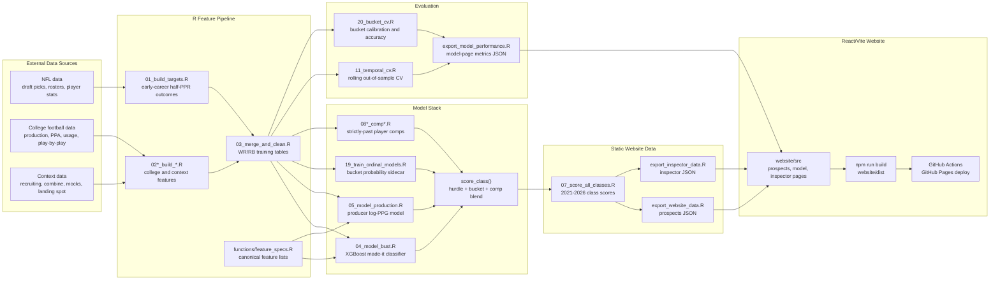

# DraftScout College-to-NFL Model

Drafting prospects in fantasy football is hard. This repo streamlines the process by using data science to analyze and project college football metrics into predictive NFL fantasy performance models.

DraftScout couples an R modeling pipeline with a React web interface to evaluate drafted and draft-eligible WR/RB prospects as early-career fantasy assets.

## How it works:
Predictive Projections: Estimates expected half-PPR PPG alongside bucket probabilities for rookie profiles (including Bust, Flex, Elite, and League-Winner tiers).

Interactive Interface: Exposes an interactive prospect dashboard, full model diagnostics, and granular, player-level inspector views.

## What It Does

- Builds NFL outcome targets from draft picks, rosters, and early-career fantasy production.
- Builds college feature sets from rushing/receiving production, team context, PPA/usage, play-by-play efficiency, recruiting, combine data, landing spot, mock draft delta, and historical comps.
- Trains separate WR and RB models.
- Scores historical and upcoming draft classes.
- Exports JSON data for a local Vite/React website.

## System Diagram



## Model Architecture

The deployed score is a blend of three signals:

1. Continuous hurdle model:
   - `p_made_it`: XGBoost classifier for whether a player records a qualifying NFL season.
   - `log_ppg_pred`: XGBoost production model trained only on NFL producers.
   - `exp_ppg = transformed_probability * exp(log_ppg_pred)`.
2. Ordinal bucket sidecar:
   - XGBoost multiclass plus Bayesian proportional-odds model.
   - Produces probabilities for `bust`, `bench`, `flex`, `elite`, and `league_winner`.
3. Historical comp blend:
   - Blends model output with leakage-safe comp-weighted PPG when comparable historical players exist.

For the detailed architecture, feature space, evaluation setup, and known data quirks, start with [MODEL_CONTEXT.md](MODEL_CONTEXT.md).

## Repository Layout

```text
.
├── 01_build_targets.R              # NFL target construction
├── 02*_build_*.R                   # College/context feature construction
├── 03_merge_and_clean.R            # Training table assembly
├── 04_model_bust.R                 # Stage 1 made-it classifier
├── 05_model_production.R           # Stage 2 producer PPG model
├── 07_score_all_classes.R          # Historical + prospect scoring
├── 11_temporal_cv.R                # Rolling out-of-sample evaluation
├── 19_train_ordinal_models.R       # Bucket probability models
├── 20_bucket_cv.R                  # Bucket model validation
├── export_website_data.R           # Website prospect JSON export
├── export_inspector_data.R         # Website inspector JSON export
├── functions/                      # Shared feature specs and scoring helpers
├── website/                        # React + TypeScript + Vite app
├── MODEL_CONTEXT.md                # Developer shortcut for model internals
└── run_pipeline.sh                 # End-to-end pipeline runner
```

Generated data, RDS caches, model binaries, CV outputs, `node_modules`, and website build output are intentionally ignored by git.

## Requirements

R packages used across the pipeline include:

- `tidyverse`
- `tidymodels`
- `xgboost`
- `vip`
- `nflreadr`
- `cfbfastR`
- `rstanarm`

The website uses Node, npm, React, TypeScript, and Vite. Install website dependencies from `website/package-lock.json`.

Some data refresh steps require API credentials in `~/.Renviron`, especially for college football data.

## Running The Pipeline

From the project root:

```bash
./run_pipeline.sh
```

Common modes:

```bash
./run_pipeline.sh score-only
./run_pipeline.sh data-only
```

Single steps can be run directly:

```bash
Rscript 11_temporal_cv.R
Rscript 20_bucket_cv.R
Rscript export_website_data.R
```

## Running The Website

```bash
cd website
npm install
npm run dev
```

Then open the local Vite URL, usually `http://127.0.0.1:5173/`.

## Current Evaluation Snapshot

The deployed model-page metrics are generated by `export_model_performance.R` from rolling out-of-sample predictions and deployed blend weights. As of the latest checked-in context:

| Split | MAE | Correlation | Bias | N |
| --- | ---: | ---: | ---: | ---: |
| All | 2.468 | 0.595 | -0.233 | 394 |
| WR | 2.361 | - | - | - |
| RB | 2.638 | - | - | - |

Use `MODEL_CONTEXT.md` for the distinction between raw hurdle metrics, bucket CV, and deployed blended metrics.

## Development Notes

- `functions/feature_specs.R` is the source of truth for model features.
- `functions/helpers.R::score_class()` is the source of truth for production scoring.
- Do not hand-edit website JSON exports; regenerate them from R scripts.
- Prefer player IDs for joins when available, with normalized name/school fallbacks where the upstream source is sparse.
- Be careful with “final” season fields: several are best eligible season values, not always chronological final-season values.
